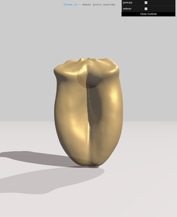

# FeteScienceDemo

Now available at [https://fgrelard.github.io/FeteScienceDemo](https://fgrelard.github.io/FeteScienceDemo)



## Getting started
THREE.js is added as a submodule. It is necessary to fetch it after cloning this repository:
```
git clone
git submodule init
git submodule update 
```

## Launching the app
```
browser layers.html
```

If your browser forbids CORS requests, you can access the app through a webserver built by the `server.py` script.
```
python server.py
browser localhost:8080
```

